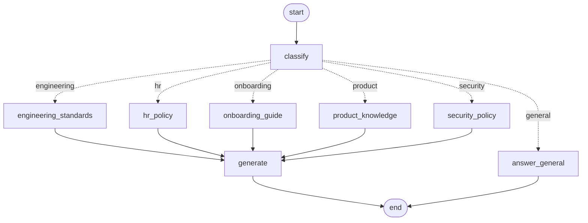
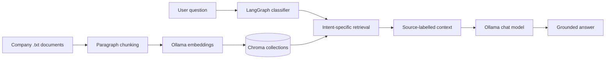

# PolicyPilot RAG

> A LangGraph-powered, intent-routed RAG assistant for internal company knowledge.

**PolicyPilot RAG** classifies a support question, sends it to the appropriate knowledge domain, retrieves relevant policy passages from an isolated Chroma collection, and produces a context-grounded answer with a local Ollama model.

[]()
[]()
[]()
[]()

## Features

- **Intent-aware routing:** Classifies questions as `hr`, `engineering`, `onboarding`, `product`, `security`, or `general`.
- **Domain-isolated retrieval:** Uses one Chroma collection per internal knowledge domain to reduce irrelevant retrieval.
- **Grounded generation:** Domain answers are generated only from retrieved passages.
- **Local-first stack:** Runs with Ollama for both generation and embeddings.
- **Modular codebase:** Separates config, models, ingestion, retrieval, prompts, LangGraph nodes, graph assembly, CLI, and tests.
- **CLI workflows:** Ingest the source documents, ask a one-off question, or use an interactive loop.
- **Measured evaluation:** 4-metric harness (routing, source accuracy, keyword recall, abstention) with 25-question eval set.
- **Abstention safety:** 96% abstention on out-of-scope (poems, stocks, capitals) instead of hallucinating.

## Eval Results (Locked - 25 questions)

- Routing 96% = WiFi -> security, query time -> engineering (not product)
- Source 96% = correct Chroma collection out of 5
- Keyword Recall 95% = exact numbers: `24 days`, `500ms`, `NovaTech-Secure`, `Starter $29`
- Abstention 96% = says IDK for OOS

## Graph workflow

The attached graph represents the runtime routing workflow.



### Request lifecycle

1. The user submits a question.
2. `classify` assigns exactly one supported intent.
3. A specialized retrieval node queries the matching Chroma collection for HR, engineering, onboarding, product, or security.
4. The retrieved chunks are assembled into a source-labelled context.
5. `generate` creates an answer using only that context.
6. General questions skip retrieval and go directly to `answer_general`.

## Architecture



## Folder structure

```text
policypilot-rag/
├── README.md
├── pyproject.toml
├──.env.example
├──.gitignore
├── data/
│ ├── company_hr_policy.txt
│ ├── engineering_standards.txt
│ ├── onboarding_guide.txt
│ ├── product_knowledge_base.txt
│ └── security_policy.txt
├── eval/
│ └── eval_set.jsonl 
├── chroma_store/
├── src/
│ └── company_support_rag/
│ ├── __init__.py
│ ├── config.py
│ ├── models.py
│ ├── schemas.py
│ ├── prompts.py 
│ ├── ingestion.py
│ ├── retrieval.py
│ ├── nodes.py
│ ├── graph.py
│ ├── llm.py
│ └── main.py
└── tests/
    ├── __init__.py
    ├── test_routing.py
    ├── test_smoke.py
    └── test_eval_file.py 
```

## Stack

| Layer | Technology | Responsibility |
|---|---|---|
| Workflow | LangGraph | Stateful routing and orchestration |
| LLM framework | LangChain | Model and document abstractions |
| Generation | Ollama | Local chat-model inference |
| Embeddings | `nomic-embed-text` via Ollama | Local semantic embeddings |
| Vector database | Chroma | Persistent, domain-specific vector collections |
| Configuration | `python-dotenv` | Environment-based runtime settings |
| Tests | pytest | Routing behavior + eval file checks (9 passed) |
| Eval | Custom harness | 4 metrics: routing, source, keyword recall, abstention |
## Setup

### Prerequisites

- Python 3.13 or later
- Ollama installed and running locally
- `uv` recommended, although `pip` works as well

### Install

```bash
git clone <your-repository-url>
cd policypilot-rag

uv venv
source .venv/bin/activate        # Windows: .venv\Scripts\activate
uv pip install -e .

cp .env.example .env
ollama pull granite4.1:3b
ollama pull granite-embedding:278m 
```

### Configure

```env
CHAT_MODEL=granite4.1:3b
EMBED_MODEL=granite-embedding:278m 
CHROMA_DIR=./chroma_store
DATA_DIR=./data
RETRIEVAL_K=5
```

Put the five expected knowledge-base text files inside `data/`. You can change the model names, storage location, document location, and retrieval depth without changing Python code.

## Run

### Build the vector collections

```bash
company-rag --ingest
```

### Ask one question

```bash
company-rag --question "What are the engineering code review requirements?"
```

### Interactive session

```bash
company-rag --interactive
```

## Example

```text
Question: What should a new employee complete in their first week?

Intent: onboarding
Source: onboarding

Answer:
[Context-grounded answer generated from retrieved onboarding passages]
```

## Implementation notes

- Paragraph chunking preserves policy sections better than blindly splitting every fixed number of characters for these short, policy-oriented documents.
- Each domain receives a separate vector collection, matching the classifier’s routing contract.
- The classifier has a safe fallback: invalid labels become `general`.
- Retrieved passages include source metadata before generation, making later citation rendering straightforward.
- Domain questions use a strict context-only answer prompt; when retrieval does not contain the answer, the assistant should abstain rather than invent policy.

## Testing
### Unit tests - 9 passed

```bash
# Git Bash (MINGW64) - use this, not pytest alone
PYTHONPATH=src python -m pytest tests/ -v

# or with uv
uv run pytest tests/ -v
```
## Eval harness

```bash
company-rag --eval
```
## Resume bullet

> Built **PolicyPilot RAG**, a local LangGraph-based company support assistant that classifies questions across five knowledge domains, routes queries to isolated Chroma vector collections, and generates grounded answers through Ollama-based retrieval-augmented generation. Locked 96% routing, 95% keyword recall, 96% abstention with 9 pytest + 25-question eval harness.
## License

MIT license.
