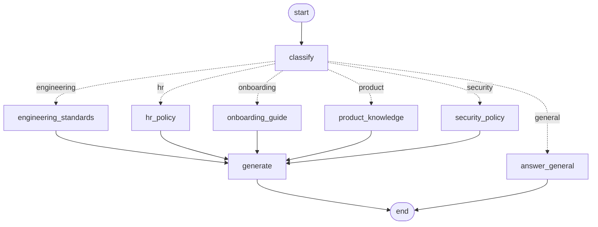
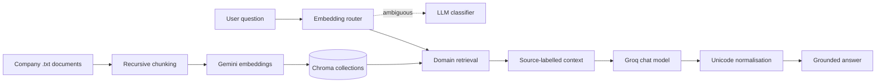

# PolicyPilot RAG

> A LangGraph-powered, intent-routed RAG assistant for internal company knowledge.

**PolicyPilot RAG** classifies a support question, sends it to the appropriate knowledge domain, retrieves relevant policy passages from an isolated Chroma collection, and produces a context-grounded answer using hosted models.

[]()
[]()
[]()

## Features

- **Embedding-based routing:** classifies questions as `hr`, `engineering`, `onboarding`, `product`, `security`, or `general` using vector similarity against each domain, with an LLM fallback only for ambiguous ties.
- **Domain-isolated retrieval:** one Chroma collection per internal knowledge domain to reduce irrelevant retrieval.
- **Grounded generation:** answers are generated only from retrieved passages, with a single canonical abstention string when the answer is not supported.
- **Code-level correctness controls:** typographic-Unicode normalisation on model output and rate-limit retry, so exact values such as `Rs 299` survive generation and long runs survive provider throttling.
- **Minimal prompts:** prompts state the task and the output contract only. Routing, abstention, and fidelity are enforced in code, not by prompt rules.
- **Modular codebase:** config, models, prompts, ingestion, retrieval, nodes, graph assembly, and CLI are separated.
- **Measured evaluation:** 4-metric harness (routing, source accuracy, keyword recall, abstention) over a 25-question eval set.

## Eval Results

Scores are intentionally left blank until the pipeline is re-measured against the current cloud configuration. Earlier figures in this file were produced by a prompt that embedded eval questions as few-shot examples; they were not a valid generalisation estimate and have been removed rather than restated.

| Metric | Result |
|---|---|
| Routing accuracy | _pending_ |
| Source accuracy (correct collection) | _pending_ |
| Keyword recall (exact values) | _pending_ |
| Abstention (out-of-scope) | _pending_ |

Run `company-rag --eval` to populate. The harness prints aggregate scores plus a per-item failure list.

## Graph workflow


```mermaid
flowchart TD
    START([start]) --> CLASSIFY[classify]
    CLASSIFY -. engineering .-> ENG[engineering_standards]
    CLASSIFY -. hr .-> HR[hr_policy]
    CLASSIFY -. onboarding .-> ONBOARD[onboarding_guide]
    CLASSIFY -. product .-> PRODUCT[product_knowledge]
    CLASSIFY -. security .-> SECURITY[security_policy]
    CLASSIFY -. general .-> GENERAL[answer_general]
    ENG --> GENERATE[generate]
    HR --> GENERATE
    ONBOARD --> GENERATE
    PRODUCT --> GENERATE
    SECURITY --> GENERATE
    GENERATE --> END([end])
    GENERAL --> END
```

### Request lifecycle

1. The user submits a question.
2. `classify` embeds the question and routes it to the nearest domain by cosine distance. Two signals short-circuit without an LLM call:
   - if no domain is within `ROUTER_MAX_DISTANCE`, the question is out of scope and routes to `general`;
   - if the top two domains are within `ROUTER_MARGIN`, the LLM classifier breaks the tie.
3. A retrieval node queries the matching Chroma collection.
4. Retrieved chunks are assembled into a source-labelled context.
5. `generate` answers from that context only, abstaining when the required fact is absent.
6. Out-of-scope questions skip retrieval entirely.

## Architecture


```mermaid
flowchart LR
    DOCS[Company .txt documents] --> INGEST[Recursive chunking]
    INGEST --> EMBED[Gemini embeddings]
    EMBED --> CHROMA[(Chroma collections)]
    USER[User question] --> ROUTER[Embedding router]
    ROUTER -. ambiguous .-> FALLBACK[LLM classifier]
    ROUTER --> RETRIEVE[Domain retrieval]
    CHROMA --> RETRIEVE
    RETRIEVE --> CONTEXT[Source-labelled context]
    CONTEXT --> LLM[Groq chat model]
    LLM --> NORM[Unicode normalisation]
    NORM --> ANSWER[Grounded answer]
```

## Folder structure

```text
policypilot-rag/
├── README.md
├── pyproject.toml
├── .env.example
├── .gitignore
├── data/
│   ├── company_hr_policy.txt
│   ├── engineering_standards.txt
│   ├── onboarding_guide.txt
│   ├── product_knowledge_base.txt
│   └── security_policy.txt
├── eval/
│   ├── eval_set.jsonl
│   └── eval_out.txt
├── notebooks/
│   └── experiments.ipynb
├── chroma_store/            # generated, gitignored
├── src/
│   └── company_support_rag/
│       ├── __init__.py
│       ├── config.py
│       ├── models.py
│       ├── schemas.py
│       ├── prompts.py
│       ├── ingestion.py
│       ├── retrieval.py
│       ├── nodes.py
│       ├── graph.py
│       └── main.py
└── tests/
    ├── __init__.py
    ├── test_routing.py
    ├── test_smoke.py
    └── test_eval_file.py
```

## Stack

All inference is hosted. There is no local model runtime.

| Layer | Technology | Responsibility |
|---|---|---|
| Workflow | LangGraph | Routing and orchestration |
| LLM framework | LangChain | Model and document abstractions |
| Generation | Groq `openai/gpt-oss-120b` | Context-grounded answer generation |
| Classification | Groq `openai/gpt-oss-20b` | Fallback tie-break only |
| Embeddings | Google `gemini-embedding-001` | Chunk and query embeddings |
| Vector database | Chroma | Persistent, domain-specific collections |
| Configuration | `python-dotenv` | Environment-based runtime settings |
| Tests | pytest | Routing behaviour and eval-file checks |
| Eval | Custom harness | Routing, source, keyword recall, abstention |

## Setup

### Prerequisites

- Python 3.13 or later
- A Groq API key
- A Google AI Studio API key (for embeddings)

### Install

```bash
git clone <your-repository-url>
cd policypilot-rag

uv venv
source .venv/bin/activate        # Windows: .venv\Scripts\activate
uv pip install -e .
```

### Configure

```bash
cp .env.example .env
```

```env
GROQ_API_KEY=your_groq_key
GOOGLE_API_KEY=your_google_key

CHAT_MODEL=openai/gpt-oss-120b
INTENT_MODEL=openai/gpt-oss-20b
MODEL_PROVIDER=groq
EMBED_MODEL=gemini-embedding-001

CHROMA_DIR=./chroma_store
DATA_DIR=./data
RETRIEVAL_K=5
```

Model names, storage location, document location, and retrieval depth are all configurable without changing Python code.

### Ingest

Embedding dimension is fixed at build time, so re-run ingestion whenever `EMBED_MODEL` changes. Ingesting into a store built by a different embedder raises a dimension mismatch.

```bash
company-rag --ingest
```

## Run

```bash
company-rag --question "What are the engineering code review requirements?"
company-rag --interactive
company-rag --eval
```

## Example

```text
Question: What should a new employee complete in their first week?

Intent: onboarding
Source: onboarding

Answer:
[Context-grounded answer generated from retrieved onboarding passages]
```

## Implementation notes

- **Routing is embedding-first.** Cosine distance against each domain collection generalises to phrasings no prompt rule anticipates. Out-of-scope questions sit far from every domain (distance > 0.55) while genuine policy questions sit well inside it, so the distance threshold separates them without asking a model to.
- **Prompts stay short on purpose.** Routing thresholds, abstention, and value fidelity are enforced in code. Adding few-shot examples from the eval set would raise scores while making the system worse at questions it has not seen.
- **Output is normalised before use.** Small models emit narrow no-break spaces and smart punctuation inside copied values, which silently breaks exact-match evaluation and downstream consumers.
- **Calls retry on provider throttling.** Hosted free tiers enforce low per-minute and per-day token caps; calls back off instead of failing the run.
- **Each domain has an isolated collection**, matching the classifier's routing contract.
- **Unparseable classifier labels degrade to `general`**, which abstains rather than inventing policy.

## Testing

```bash
PYTHONPATH=src python -m pytest tests/ -v

# or
uv run pytest tests/ -v
```

## License

MIT license.